# Abstract

**SentinelFW** is a local nftables firewall manager and security monitor for
Linux, developed and tested on Kali Linux. It was built to address a specific gap:
managing a packet filter and understanding what that filter is actually doing are
two separate skills, and the tools available to a learner usually force a choice
between one and the other. SentinelFW joins them.

The tool keeps its firewall rules in a human-readable `rules.yaml` file rather
than applying them directly, and it never lets a rule change reach the kernel
until the operator explicitly runs `firewall apply`. Before anything is
installed, SentinelFW prints the *complete* `nft` script it intends to run, takes
a backup of the live ruleset, asks for confirmation, applies the script as a
single atomic transaction, and then re-reads the kernel ruleset to verify that
what it installed is what it intended. Every rule it creates is confined to one
object it owns — `table inet sentinelfw`, chain `input`, a base chain at priority
`-10` with policy `accept` — so it can add filtering without ever becoming the
reason a machine stops answering.

On the monitoring side, SentinelFW reads the log lines that its own rules
produce, stores them in a SQLite database, and runs five threshold-and-window
detectors over them: port scans, brute-force attempts, repeated blocks on a
closed port, connection spikes, and probes against sensitive services. Findings
are de-duplicated by fingerprint, carry the evidence that produced them, and are
explained in plain language with concrete next steps. A terminal dashboard, a
report generator in three formats, and a small knowledge base for ports and
attack types round out the tool.

The project comprises **9,248 lines of application code** across 23 source
modules and **1,313 lines** of tests. The test suite contains **160 tests**, all
of which pass in approximately **51 seconds** with an overall statement coverage
of **72%**. The suite runs entirely against temporary directories and never
invokes `nft`; the root-only paths are exercised by asserting that they refuse
rather than by applying rules.

This report documents the motivation, design, architecture, implementation,
testing methodology, measured results, security analysis, limitations and future
direction of SentinelFW. It is intended to serve as the final technical report
for the project and as a reference for anyone evaluating or extending it.

# Acknowledgement

This project builds directly on the work of the open-source community. It would
not exist without **nftables** and its `nft` command-line interface, the **Linux
kernel** netfilter subsystem that produces the log lines SentinelFW reads,
**SQLite** for embedded storage, the **Python** language and standard library,
and the **Rich** library for terminal rendering. The design also learned from the
safety posture of mature firewall front-ends: preview first, back up always,
confirm explicitly.

# Declaration

I declare that SentinelFW is my own original work. It was designed, implemented,
tested and documented by me. All external libraries and tools used are
acknowledged above and in the References section, and no part of this work
misrepresents the contribution of others.

# Table of Contents

[TOC]

# List of Figures

<p class="lof"><a href="#fig-arch">Figure 1 — Layered system architecture</a></p>
<p class="lof"><a href="#fig-component">Figure 2 — Component and dependency diagram</a></p>
<p class="lof"><a href="#fig-usecase">Figure 3 — Use case diagram</a></p>
<p class="lof"><a href="#fig-flow">Figure 4 — firewall apply control flow</a></p>
<p class="lof"><a href="#fig-seq">Figure 5 — Detection sequence diagram</a></p>
<p class="lof"><a href="#fig-activity">Figure 6 — Monitoring activity diagram</a></p>
<p class="lof"><a href="#fig-deploy">Figure 7 — Deployment diagram</a></p>
<p class="lof"><a href="#fig-er">Figure 8 — Database entity-relationship diagram</a></p>
<p class="lof"><a href="#fig-cov">Figure 9 — Code coverage by module</a></p>
<p class="lof"><a href="#fig-tests">Figure 10 — Test distribution across the suite</a></p>
<p class="lof"><a href="#fig-perf">Figure 11 — In-process operation latency</a></p>
<p class="lof"><a href="#fig-doctor">Figure 12 — <code>sentinelfw doctor</code> environment check</a></p>
<p class="lof"><a href="#fig-block">Figure 13 — Recording a block rule</a></p>
<p class="lof"><a href="#fig-list">Figure 14 — Listing stored rules</a></p>
<p class="lof"><a href="#fig-preview">Figure 15 — Previewing the exact nft script</a></p>
<p class="lof"><a href="#fig-demo">Figure 16 — Synthetic traffic demonstration</a></p>
<p class="lof"><a href="#fig-dash">Figure 17 — Live terminal dashboard</a></p>
<p class="lof"><a href="#fig-alerts">Figure 18 — Alerts with plain-language explanations</a></p>
<p class="lof"><a href="#fig-report">Figure 19 — Generated security report</a></p>
<p class="lof"><a href="#fig-explain">Figure 20 — explain port 22</a></p>

# List of Tables

<p class="lot"><a href="#tbl-req">Table 1 — System and software requirements</a></p>
<p class="lot"><a href="#tbl-stack">Table 2 — Technology stack</a></p>
<p class="lot"><a href="#tbl-modules">Table 3 — Module responsibilities</a></p>
<p class="lot"><a href="#tbl-config">Table 4 — Principal configuration defaults</a></p>
<p class="lot"><a href="#tbl-detectors">Table 5 — Detectors and default thresholds</a></p>
<p class="lot"><a href="#tbl-exit">Table 6 — Exit codes</a></p>
<p class="lot"><a href="#tbl-cli">Table 7 — Command reference</a></p>
<p class="lot"><a href="#tbl-invariants">Table 8 — Safety invariants and enforcement</a></p>
<p class="lot"><a href="#tbl-env">Table 9 — Test environment</a></p>
<p class="lot"><a href="#tbl-rules">Table 10 — Rule validation and injection test results</a></p>
<p class="lot"><a href="#tbl-config-tests">Table 11 — Configuration test results</a></p>
<p class="lot"><a href="#tbl-mon-tests">Table 12 — Storage and detection test results</a></p>
<p class="lot"><a href="#tbl-cli-tests">Table 13 — End-to-end CLI test results</a></p>
<p class="lot"><a href="#tbl-safety-tests">Table 14 — Safety and containment test results</a></p>
<p class="lot"><a href="#tbl-test-summary">Table 15 — Test summary by module</a></p>
<p class="lot"><a href="#tbl-perf-lib">Table 16 — In-process latency measurements</a></p>
<p class="lot"><a href="#tbl-perf-e2e">Table 17 — End-to-end CLI command latency</a></p>
<p class="lot"><a href="#tbl-coverage">Table 18 — Coverage by module</a></p>
<p class="lot"><a href="#tbl-security">Table 19 — Security controls and their tests</a></p>
<p class="lot"><a href="#tbl-limits">Table 20 — Known limitations</a></p>
<p class="lot"><a href="#tbl-future">Table 21 — Future enhancements</a></p>

# 1. Introduction

## 1.1 What SentinelFW is

SentinelFW is a command-line tool that manages a single nftables chain and
monitors the traffic that chain sees. It is written in Python, requires no
compiled components, and runs straight from a cloned directory or as an installed
`sentinelfw` command. It presents nine groups of subcommands — `firewall`,
`monitor`, `alerts`, `report`, `dashboard`, `explain`, `db`, `config`, and
`doctor` — behind one entry point.

The tool is deliberately narrow. It does not try to be a complete firewall. It
manages *one* table, `table inet sentinelfw`, adds filtering at an early priority
so that its drops take effect before most services see the packet, and uses an
`accept` policy so that traffic no rule matches carries on unaffected. It cannot
lock an operator out of their own machine, which is the failure mode that makes
firewall tooling frightening.

## 1.2 Why it exists

A firewall change is one of the few routine actions that can render a machine
unreachable. Yet most beginner-facing tooling hides the command it runs, applies
rules straight from a text file with no snapshot, and offers no route back if the
result was wrong. At the same time, the reason a learner wants a firewall at all
is usually to *see* what is happening: which addresses are knocking, which ports
are being probed, whether the block they added is actually doing anything.

SentinelFW was written to close both gaps at once. It makes firewall changes
inspectable and reversible, and it turns the firewall's own logs into
explanations a learner can act on.

## 1.3 Scope

In scope: rule management for addresses, networks and TCP/UDP ports; safe,
atomic application of those rules; ingestion of the firewall's log lines from the
systemd journal, from log files, or from a synthetic demo stream; storage of
events in SQLite; five detectors; alerting with de-duplication; a terminal
dashboard; text, Markdown and JSON reports; and a knowledge base for ports and
attack patterns.

Out of scope: full-ruleset authoring, packet capture or deep packet inspection,
signature-based intrusion detection, remote or multi-host management, and any
form of machine learning.

## 1.4 Report organisation

Section 2 states the problem. Section 3 lists objectives. Section 4 compares
SentinelFW briefly with existing tools. Sections 5–7 cover requirements,
technology and architecture. Sections 8–10 present the UML views, database design
and folder structure. Sections 11–13 describe the modules and the key
implementation workflows. Section 14 shows the interface. Sections 15–17 document
the test plan, the results of all 160 tests, and measured performance. Sections
18–20 analyse security and state limitations and future work. Section 21
concludes.

# 2. Problem Statement

Managing nftables correctly is hard for four reasons.

**First, the command surface is unforgiving.** nftables rules are applied with
`nft`, and the same command that installs a rule can, with a small mistake,
flush an entire ruleset. The difference between `flush chain` and `flush table`
is the difference between clearing your own rules and destroying everything —
including the rules Docker and UFW rely on. Tools that hide the command being run
remove the operator's ability to notice that difference.

**Second, changes are rarely reversible by default.** Most approaches write a
ruleset file and load it, with no snapshot of what was there before. If the
result is wrong, there is nothing to roll back to.

**Third, the firewall is noisy but opaque.** A drop produces a kernel log line.
Those lines accumulate in the journal, and reading a wall of
`SRC=… DST=… DPT=…` tells an experienced administrator a great deal and tells a
learner almost nothing. There is no shortage of logs; there is a shortage of
interpretation.

**Fourth, existing security tools assume expertise.** Full IDS platforms are
powerful but heavy and configured by specialists. The beginner is left choosing
between a single `nft` command they do not fully understand and a platform they
cannot reasonably run.

SentinelFW addresses these points directly: it separates the *decision* to change
a rule from the *act* of changing it, it backs up before it acts and verifies
after, it summarises and explains the traffic the firewall logs, and it keeps the
whole surface small enough to read in an afternoon.

# 3. Objectives

1. **Manage firewall rules safely.** Provide a small, validated vocabulary for
   blocking and allowing addresses, networks and ports, stored in a
   human-readable file.
2. **Never surprise the kernel.** Make rule changes and kernel changes separate,
   explicit steps, preview the exact command, back up, confirm, apply atomically,
   and verify.
3. **Contain blast radius.** Modify exactly one nftables object and refuse
   anything else.
4. **Monitor firewall activity.** Ingest the firewall's own log lines from
   realistic sources and store them durably.
5. **Detect suspicious behaviour.** Apply transparent, tunable heuristics that a
   learner can reason about.
6. **Explain, not just count.** Turn events and findings into plain-language
   descriptions with recommended actions.
7. **Report.** Produce human and machine-readable summaries of security state.
8. **Be a good citizen.** Run without root where possible, drop privileges where
   not needed, and require explicit consent for every mutation.
9. **Be testable without a live firewall.** Verify behaviour against temporary
   directories and never touch the kernel during tests.

# 4. Literature Review and Comparison

SentinelFW sits in a crowded space, but at an unusual point in it. The table
below compares it with the tools a learner is most likely to encounter. The
comparison is qualitative and reflects documented scope, not benchmarked
performance.

| Tool | Category | Strengths | How SentinelFW differs |
|---|---|---|---|
| `nft` / `nftables` | Packet filter | The real thing; complete control; kernel-native | SentinelFW is a *manager in front of* one chain, adding preview, backup, explanation and monitoring; not a replacement |
| UFW | Front-end | Simple allow/deny; widely documented | UFW owns the whole ruleset; SentinelFW owns one table, coexists with UFW/Docker, and adds detection |
| firewalld | Front-end | Zones, services, dynamic rules | Service-level abstraction; SentinelFW is address/port focused and log-centric rather than zone-centric |
| Fail2ban | Reactive blocker | Parses logs and auto-bans | Fail2ban reacts; SentinelFW *detects and explains* but does not silently ban, keeping a human in the loop |
| Suricata / Snort | IDS/IPS | Signature and protocol analysis on live traffic | Packet-based and heavy; SentinelFW is log-based, lightweight, and heuristic |
| ELK / Wazuh | SIEM | Aggregation, dashboards, correlation at scale | Multi-host and infrastructure-level; SentinelFW is single-host, local-first, and dependency-light |

The gap SentinelFW fills is the *learning* gap: a tool whose generated command is
always shown, whose detection rules are readable, whose findings come with
explanations, and which is safe enough to run on the same machine you are
learning on.

# 5. System Requirements

<p class="tblcap" id="tbl-req">Table 1 &mdash; System and software requirements.</p>

| Category | Requirement | Notes |
|---|---|---|
| Operating system | Linux | Developed and tested on Kali Linux (Debian-based) |
| Python | 3.10 or newer | Tested on CPython 3.14.7 |
| Python packages | `rich` ≥ 13, `PyYAML` ≥ 6 | Also available as distro packages |
| System package | `nftables` | Only needed to touch the live ruleset |
| Storage | ~5 MB on disk | SQLite database grows with events |
| Privileges | Root only for `apply`, `validate`, `backup`, `restore`, and journal reads | Everything else runs unprivileged |
| Optional | Membership in `systemd-journal` group | To read the kernel journal without root |
| Hardware | Any modern x86-64/ARM Linux host | No GPU, no packet-capture NIC |

The test environment used for this report is summarised in Table 9.

# 6. Technology Stack

<p class="tblcap" id="tbl-stack">Table 2 &mdash; Technology stack.</p>

| Layer | Technology | Role in SentinelFW |
|---|---|---|
| Language | Python 3.10+ | Entire application |
| Packet filter | nftables / `nft` | The kernel ruleset SentinelFW manages and logs |
| Persistence | SQLite 3.53 | Events, alerts, rule-hit counters, metadata |
| Configuration | YAML via `PyYAML.safe_load` | `config.yaml` and `rules.yaml` |
| Terminal UI | Rich 15 | Tables, panels, colour, live dashboard |
| Logging | Python `logging` + `RotatingFileHandler` | `logs/sentinelfw.log`, including every `nft` call |
| Log sources | `journalctl`, plain files, stdin, synthetic demo | Input to the parser |
| Process execution | `subprocess.run` with argument lists | The only way an external command is run |
| Packaging | `setuptools` / `pyproject.toml` | `sentinelfw` console entry point |
| Testing | pytest 9 | 160 tests, plus `pytest-cov` for coverage |

Design choices of note:

- **`yaml.safe_load` only.** Configuration and rules are data, never code, so a
  hostile YAML file cannot execute.
- **No shell, ever.** Every external command is executed as an argument list;
  no string is handed to a shell to interpret.
- **Standard library first.** `ipaddress`, `sqlite3`, `subprocess`, `re`,
  `threading`, `argparse` and `dataclasses` carry most of the load; the only
  third-party runtime dependencies are Rich and PyYAML.

# 7. System Architecture

SentinelFW is organised into four layers. The presentation layer is what the
operator types and sees; the service layer orchestrates commands; the domain
layer validates, renders and parses; and the infrastructure layer is the set of
external systems and persisted state the tool depends on.

<div class="figure" id="fig-arch">
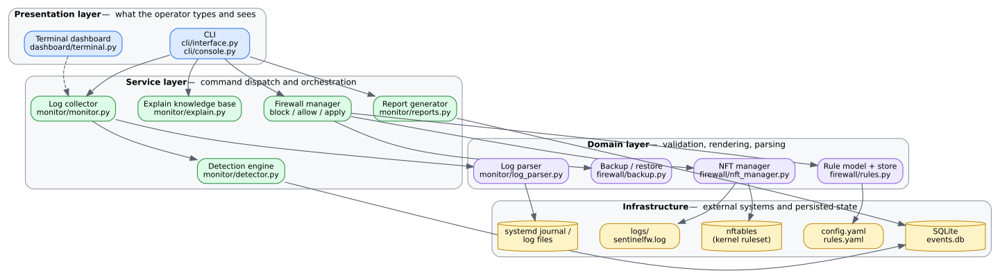
<p class="figcap">Figure 1 &mdash; Layered system architecture of SentinelFW.</p>
</div>

## 7.1 Layering rules

- The **presentation layer** never talks to the kernel or the database directly
  except through the service layer (the dashboard reads the database for
  display, which is a deliberate, read-only exception).
- The **service layer** owns policy decisions: whether to apply, whether to
  detect, whether to persist.
- The **domain layer** owns correctness: validation, nft rendering, log parsing,
  rule ordering and conflict detection.
- The **infrastructure layer** is the only place where `nft`, files, SQLite and
  the journal are actually touched.

## 7.2 Module interaction

Figure 2 shows the concrete module dependencies. `cli.interface` is the hub: it
parses arguments, loads configuration once, and dispatches to the domain and
service modules. The firewall modules depend on configuration for identifiers
but never on the CLI. The monitoring modules depend on the database and the
explain knowledge base. Cross-cutting concerns — errors, logging, formatting —
live in `exceptions.py`, `logsetup.py` and `utils.py`.

<div class="figure" id="fig-component">
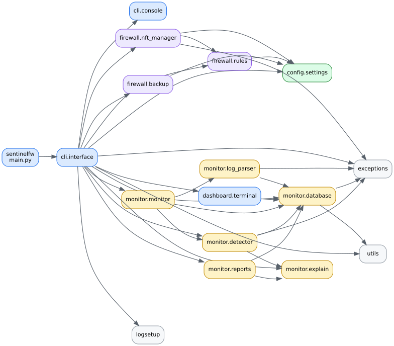
<p class="figcap">Figure 2 &mdash; Component and dependency diagram.</p>
</div>

## 7.3 Data flow

There are two principal data flows.

**Firewall flow.** A command such as `firewall block-ip` validates input, checks
for duplicates or contradictions, and appends a rule to `rules.yaml`. Nothing
reaches the kernel. A later `firewall apply` renders the whole `rules.yaml` into
one nft script, prints it, snapshots the live ruleset into `backups/`, confirms,
runs `nft -c -f -` to check syntax, runs `nft -f -` to apply atomically, and
re-reads the live ruleset to verify.

**Monitoring flow.** A log source (journal, file, stdin or demo) yields raw
lines. `NFLogParser` recognises the `SENTINELFW-DROP` / `SENTINELFW-ACCEPT`
prefixes and builds `FirewallEvent` objects, which are batched and bulk-inserted
into SQLite. The `DetectionEngine` then runs five detectors as SQL aggregate
queries over a sliding window, de-duplicates findings by fingerprint, applies a
cooldown, and stores or updates alerts. Reports, the dashboard and `explain`
read the resulting database.

# 8. UML and Design Diagrams

## 8.1 Use case view

The operator interacts with the rule, monitoring, alerting, reporting and
explanation use cases. Three use cases cross a privilege boundary: applying rules
to the kernel, backing up or restoring the ruleset, and reading the kernel
journal all require root or group membership. Applying is the only use case that
writes to the nftables kernel state.

<div class="figure" id="fig-usecase">
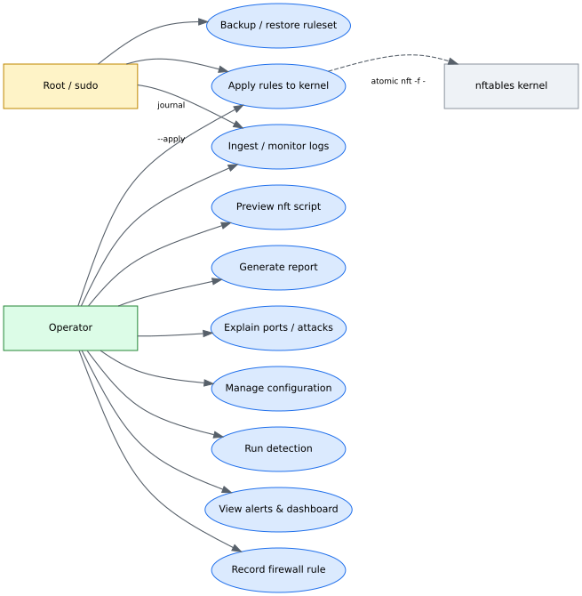
<p class="figcap">Figure 3 &mdash; Use case diagram.</p>
</div>

## 8.2 `firewall apply` control flow

The most safety-critical workflow is applying rules. Figure 4 shows every gate a
run must pass. Each failure path leaves the machine unchanged, and the successful
path always ends with a verification read-back rather than an assumption.

<div class="figure" id="fig-flow">
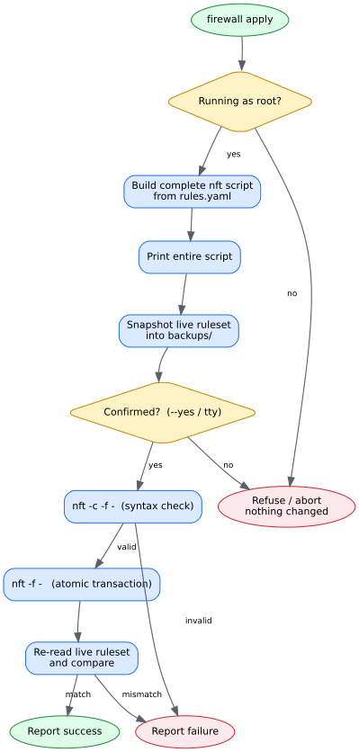
<p class="figcap">Figure 4 &mdash; <code>firewall apply</code> control flow.</p>
</div>

## 8.3 Detection sequence

Figure 5 shows one monitoring cycle as a sequence: the collector opens a source,
parses lines, batch-writes events, then hands control to the detection engine,
which issues aggregate queries and records de-duplicated alerts before returning
a result the collector can print.

<div class="figure" id="fig-seq">
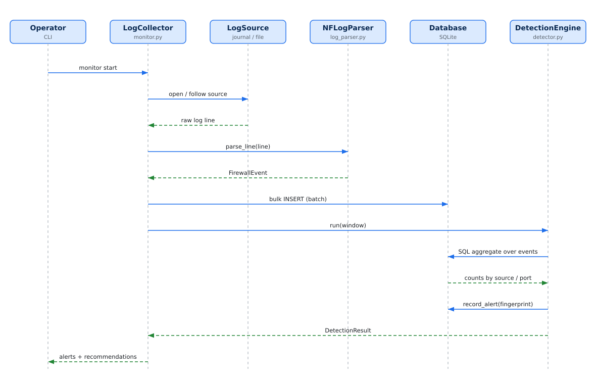
<p class="figcap">Figure 5 &mdash; Detection sequence diagram.</p>
</div>

## 8.4 Monitoring activity

Figure 6 shows the monitoring loop as an activity diagram, including the batch
flush decision and the two clean exits (source unavailable, and stop/Ctrl-C).

<div class="figure" id="fig-activity">
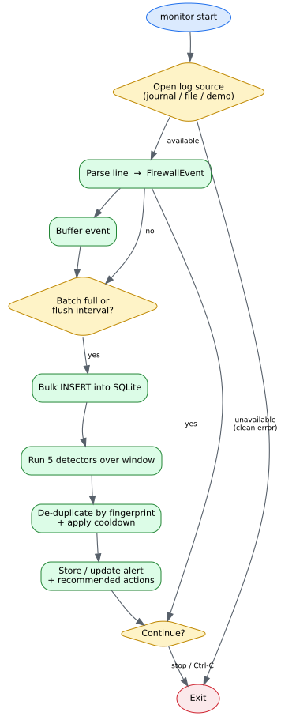
<p class="figcap">Figure 6 &mdash; Monitoring activity diagram.</p>
</div>

## 8.5 Deployment view

SentinelFW runs as an unprivileged user for everything except applying,
validating, restoring and journal reads. Figure 7 shows the deployment: the CLI
and its project state live in the user session; `nft` and the SQLite database are
touched on behalf of the user, with the root-only operations isolated.

<div class="figure" id="fig-deploy">
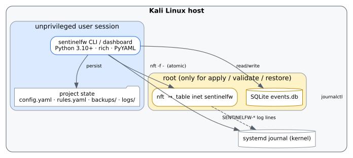
<p class="figcap">Figure 7 &mdash; Deployment diagram.</p>
</div>

# 9. Database Design

SentinelFW stores monitoring state in a single SQLite file, by default
`database/events.db`. The schema is versioned through a `meta` table and created
on first use; the current schema version is `1`. The connection enables WAL mode,
`NORMAL` synchronisation, a busy timeout, and foreign keys, and is guarded by a
re-entrant lock so the collector and the CLI can coexist.

## 9.1 Entity-relationship diagram

<div class="figure" id="fig-er">
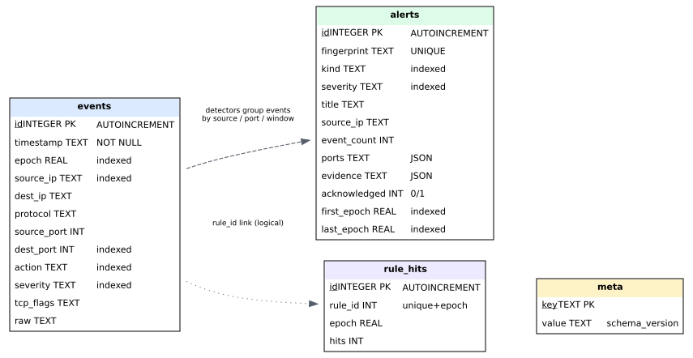
<p class="figcap">Figure 8 &mdash; Database entity-relationship diagram.</p>
</div>

## 9.2 Tables

**`events`** stores one row per parsed firewall log line: timestamp and epoch,
source and destination addresses and ports, protocol, action (`DROP`/`ACCEPT`),
severity, TCP flags, packet length, and the raw line. It is indexed on epoch,
`(source_ip, epoch)`, `(dest_port, epoch)`, `(action, epoch)` and
`(severity, epoch)` so that detectors can answer windowed questions by index
rather than by scanning the whole history.

**`alerts`** stores one row per distinct finding, keyed by a unique
`fingerprint`. Repeated detections of the same finding update `event_count` and
`last_seen` rather than inserting duplicates. The `ports` and `evidence` columns
hold JSON. An `acknowledged` flag records that an operator has handled it, and
`first_epoch` / `last_epoch` are indexed for time-range queries.

**`rule_hits`** accumulates per-rule hit counts in `(rule_id, epoch)` buckets
using a unique index that lets repeated updates collapse into one row per
second-window.

**`meta`** is a simple key/value store holding `schema_version` and
`created_at`, and is the anchor for future migrations.

## 9.3 Retention

Events older than `database.retention_days` (90 by default) can be removed with
`monitor prune`, and the file compacted with `monitor vacuum`. Pruning removes
only events older than the cutoff; alerts are retained unless the whole database
is reset.

# 10. Project Folder Structure

```
SentinelFW/
├── sentinelfw              executable launcher (runs with no install)
├── main.py                 entry point: python3 main.py
├── cli/
│   ├── interface.py        argument parsing, dispatch, confirmation flow
│   └── console.py          previews, tables, confirmations
├── config/
│   └── settings.py         typed configuration, validation, safe loading
├── firewall/
│   ├── rules.py            rule model, validation, nft rendering, rules.yaml
│   ├── nft_manager.py      the only code that runs nft; containment rules
│   └── backup.py           snapshot and restore
├── monitor/
│   ├── database.py         SQLite schema, event and alert storage
│   ├── log_parser.py       kernel log parsing and log sources
│   ├── detector.py         the five detectors
│   ├── monitor.py          the collector that joins it all together
│   ├── explain.py          the knowledge base behind `explain`
│   └── reports.py          text, markdown and JSON reports
├── dashboard/
│   └── terminal.py         Rich dashboard
├── exceptions.py           one exception per anticipated failure, each with a hint
├── logsetup.py             rotating logs, including every nft command
├── utils.py                time, formatting and small helpers
├── version.py              version and schema constants
├── tests/                  160 tests; none of them touch the kernel
├── docs/                   SAFETY.md, this report, diagrams, screenshots
├── pyproject.toml          packaging and the `sentinelfw` entry point
├── requirements.txt        runtime dependencies
└── README.md               user-facing overview
```

State that is *not* source — `config.yaml`, `rules.yaml`, `database/`, `logs/`,
`backups/` and `reports/` — is gitignored and created next to the configuration
file, so an installed `sentinelfw` run from a new directory creates its project
there instead of scattering files back into the source tree.

# 11. Module Description

<p class="tblcap" id="tbl-modules">Table 3 &mdash; Module responsibilities.</p>

| Module | Responsibility |
|---|---|
| `cli/interface.py` | Argument parsing (groups, subcommands, global flags), command dispatch, exit-code mapping, top-level error handling |
| `cli/console.py` | Change previews, Rich tables, confirmation prompts, and the rule that a mutation must not assume consent |
| `config/settings.py` | Typed configuration sections, validation, `safe_load`, path resolution, file-permission hardening |
| `firewall/rules.py` | `Rule` model, value validation, nft rendering, ordering, duplicate/contradiction detection, `rules.yaml` persistence |
| `firewall/nft_manager.py` | The only code that runs `nft`; builds the full script, enforces table containment, applies atomically, verifies |
| `firewall/backup.py` | Snapshot the live ruleset, list backups, restore (with an explicit destructive warning) |
| `monitor/log_parser.py` | Log sources (journal, file, stdin, demo, command) and parsing of `SENTINELFW-*` lines into `FirewallEvent` |
| `monitor/database.py` | SQLite schema and migrations, event/alert storage, aggregate queries, stats, prune, vacuum, export |
| `monitor/detector.py` | Five detectors, fingerprinting, cooldown, evidence and recommendation assembly |
| `monitor/monitor.py` | The `LogCollector` that reads a source, batches writes, runs detection, and reports statistics |
| `monitor/explain.py` | Knowledge base for ports, attack kinds, and remediation steps |
| `monitor/reports.py` | `SecurityReport` assembly and rendering to text, Markdown and JSON |
| `dashboard/terminal.py` | Responsive Rich dashboard with a `--once` snapshot mode |
| `exceptions.py` | Exception hierarchy with one class per anticipated failure, each carrying a hint and an exit code |
| `logsetup.py` | Rotating file logging, including every `nft` command the tool runs |
| `utils.py` | Time conversion, IP masking, human formatting, safe subprocess execution |

## 11.1 The detector set

<p class="tblcap" id="tbl-detectors">Table 5 &mdash; Detectors and default thresholds.</p>

| Kind | Default trigger | Window | Meaning |
|---|---|---|---|
| `port_scan` | 20 distinct ports from one source | 60 s | Reconnaissance across many services |
| `brute_force` | 100 attempts on one port | 300 s | Automated password or key probing |
| `repeated_block` | 50 hits on one port | 600 s | Persistent hammering of a closed port |
| `connection_spike` | 300 connections overall | 60 s | Unusual aggregate volume |
| `sensitive_port` | Any traffic to a watched port | 60 s | Traffic to services that should not be exposed |

Every threshold and window lives under `detection:` in `config.yaml`, together
with `alert_cooldown_seconds` (900 by default). The watched ports are FTP (21),
SSH (22), Telnet (23), SMTP (25), DNS (53), HTTP (80), POP3 (110), IMAP (143),
HTTPS (443), SMB (445), MSSQL (1433), MySQL (3306), RDP (3389), PostgreSQL
(5432), VNC (5900), Redis (6379), HTTP-alt (8080/8443) and MongoDB (27017).

# 12. Implementation Details

## 12.1 The safety invariants

The heart of the project is a small set of invariants, each enforced in code and
covered by tests. They are stated in full in `docs/SAFETY.md`.

<p class="tblcap" id="tbl-invariants">Table 8 &mdash; Safety invariants and enforcement.</p>

| # | Invariant | Enforced by |
|---|---|---|
| 1 | A rule change never touches the kernel | `firewall/rules.py` has no access to `subprocess`; only `nft_manager.py` runs `nft`; `apply` is explicit |
| 2 | SentinelFW owns exactly one nftables object | `nft_manager.py` refuses any table other than `inet sentinelfw`; tests assert no other table statement appears |
| 3 | A failed apply cannot leave a broken chain | Script emits `flush chain`, not `flush table`; a single `nft -f -` transaction; verify by read-back |
| 4 | Consent is never assumed | `cli/console.py` refuses a confirmation when non-interactive and `--yes` is absent |
| 5 | Input cannot escape into the script | IPs via `ipaddress`, ports range-checked, protocols whitelisted, comments sanitised, custom rules reject newline/`;` |
| 6 | Restore is loud about being destructive | `firewall/backup.py` plus explicit CLI warning; no quieter flag exists |
| 7 | Configuration is data, never code | `yaml.safe_load` only, everywhere |
| 8 | Nothing runs a shell | `utils.run_command` uses argument lists; no `shell=True` anywhere |

## 12.2 Applying rules

`firewall apply` is the only command that changes the kernel, and it is
deliberately ceremonial:

1. Refuse unless running as root.
2. Build the complete script from `rules.yaml` and print all of it.
3. Snapshot the live ruleset into `backups/`.
4. Ask for confirmation, unless `--yes`.
5. Re-check the script with `nft -c -f -` (check only).
6. Apply it with `nft -f -` as one atomic transaction.
7. Read the live ruleset back and compare it with the intent.
8. Log every command that was run.

If any of steps 6–8 fails, the run is reported as a failure. The tool never
claims to have installed rules it has not verified.

## 12.3 Rule ordering and conflicts

Rules are rendered in an order that evaluates allows before drops so that an
explicit allow is not shadowed by a broader block. When a newly added rule would
make an existing rule unreachable, SentinelFW says so. Recording an identical or
contradicting rule is refused; `--yes` suppresses prompts only, and does **not**
bypass that check — overriding it is the separate, explicit `--force` flag. This
distinction matters because an unattended run must not quietly accumulate
duplicate rules.

## 12.4 Parsing without crashing

The parser is written to be defensive: unrelated kernel lines, empty lines and
missing fields all return `None` or a partial event rather than raising. TCP
flags written by nft as `syn,ack` are condensed into a short form. Severity is
assigned at parse time based on whether the destination port is watched.

# 13. Configuration

`config.yaml` is created with mode `0600` and commented defaults. Relative paths
resolve next to the configuration file, so pointing `--config` or
`SENTINELFW_CONFIG` at another directory moves the whole project there.

<p class="tblcap" id="tbl-config">Table 4 &mdash; Principal configuration defaults.</p>

| Key | Default | Meaning |
|---|---|---|
| `firewall.table` | `sentinelfw` | The one table SentinelFW owns |
| `firewall.family` | `inet` | Address family |
| `firewall.chain` | `input` | Chain name |
| `firewall.priority` | `-10` | Base chain priority (before most services) |
| `firewall.policy` | `accept` | Chain policy; cannot lock the host out |
| `firewall.log_prefix` | `SENTINELFW` | Log prefix the parser looks for |
| `database.path` | `database/events.db` | SQLite file |
| `database.retention_days` | `90` | Retention window |
| `monitoring.source` | `journal` | `journal`, `file`, `stdin` or `demo` |
| `detection.port_scan_threshold` | `20` | Distinct ports per source |
| `detection.brute_force_threshold` | `100` | Attempts on one port |
| `detection.alert_cooldown_seconds` | `900` | Suppression window per finding |
| `report.default_period` | `24h` | Default reporting window |
| `dashboard.refresh_seconds` | `3.0` | Live dashboard refresh |

# 14. Interface Design

SentinelFW is a text-first tool. It uses Rich to render tables, panels and a live
dashboard, and it adapts to terminal width: on a narrow window it drops optional
columns rather than crushing every column to one character. Machine-readable
commands support `--json` and always emit a single valid JSON document, so output
can be piped to `jq`.

## 14.1 Environment check

`doctor` reports the state of the machine — Python version, packages, the `nft`
binary, privileges, configuration permissions, journal access, the firewall
table, the database and free disk — and exits with code 6 when something needs
attention.

<div class="figure shot" id="fig-doctor">
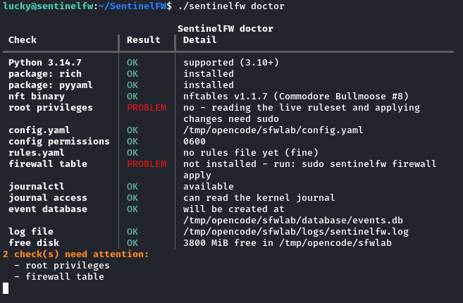
<p class="figcap">Figure 12 &mdash; <code>sentinelfw doctor</code> environment check (non-root, firewall not yet installed).</p>
</div>

## 14.2 Recording and previewing a rule

Recording a rule shows what will happen and what the nft statement will be, while
making clear that nothing has been applied yet.

<div class="figure shot" id="fig-block">
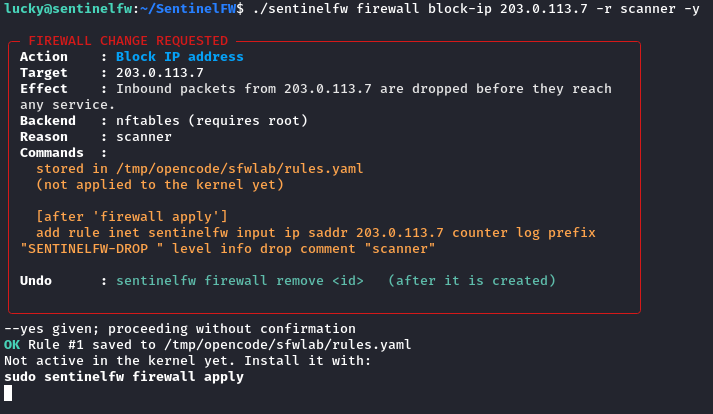
<p class="figcap">Figure 13 &mdash; Recording a block rule; the kernel is not touched.</p>
</div>

<div class="figure shot" id="fig-list">
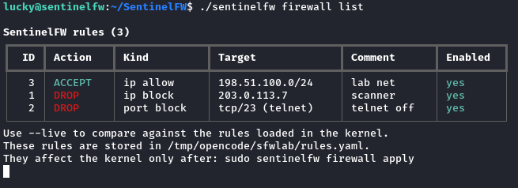
<p class="figcap">Figure 14 &mdash; Listing stored rules from <code>rules.yaml</code>.</p>
</div>

<div class="figure shot" id="fig-preview">
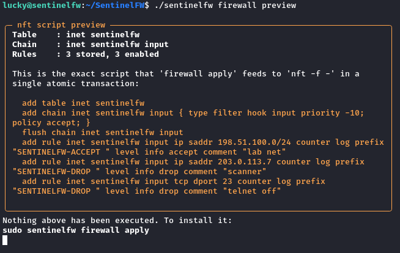
<p class="figcap">Figure 15 &mdash; Previewing the exact <code>nft</code> script that <code>apply</code> would run.</p>
</div>

## 14.3 Monitoring and detection

The demo stream lets a learner exercise the whole pipeline without root, a real
attacker, or real traffic. It is labelled as synthetic everywhere it appears.

<div class="figure shot" id="fig-demo">
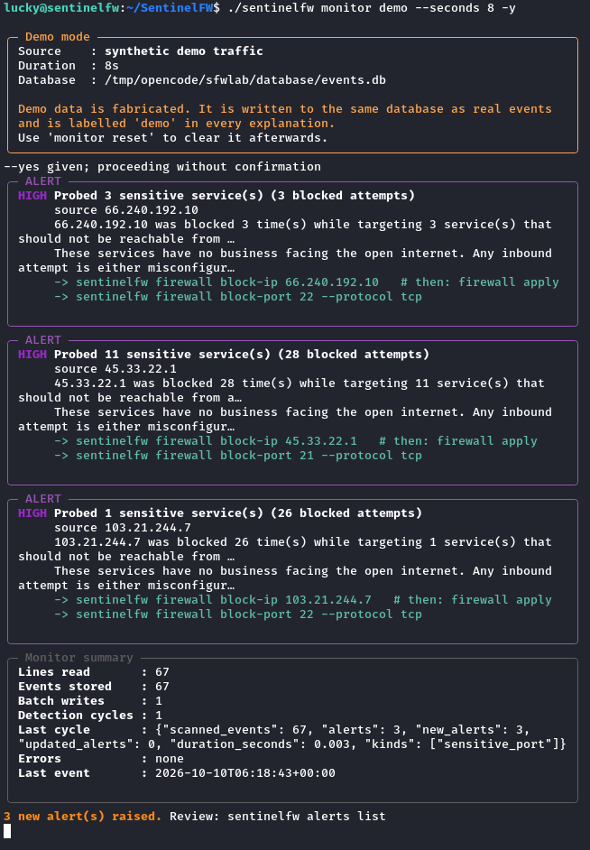
<p class="figcap">Figure 16 &mdash; Synthetic traffic demonstration, with alerts raised.</p>
</div>

<div class="figure shot" id="fig-dash">
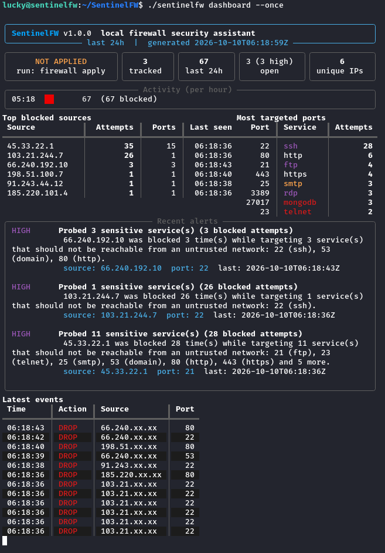
<p class="figcap">Figure 17 &mdash; Terminal dashboard snapshot.</p>
</div>

<div class="figure shot" id="fig-alerts">
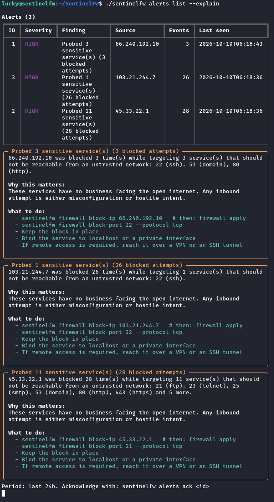
<p class="figcap">Figure 18 &mdash; Alerts with plain-language explanations and next steps.</p>
</div>

<div class="figure shot" id="fig-report">
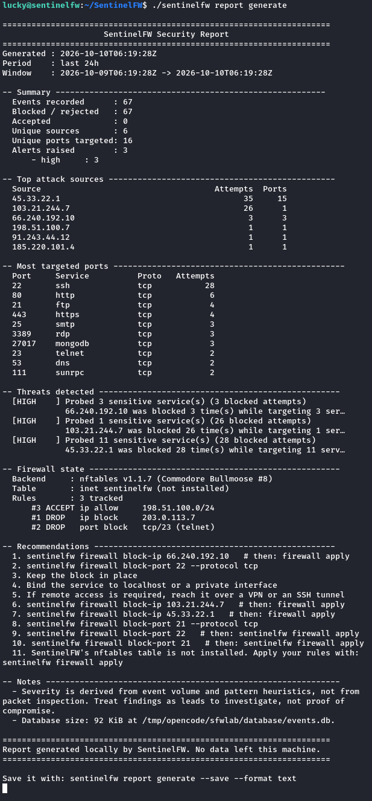
<p class="figcap">Figure 19 &mdash; Generated security report (text format).</p>
</div>

<div class="figure shot" id="fig-explain">
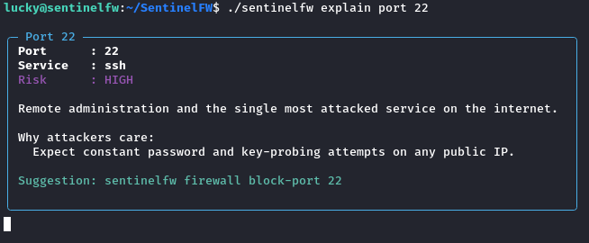
<p class="figcap">Figure 20 &mdash; <code>explain port 22</code>, from the knowledge base.</p>
</div>

# 15. Command Reference

<p class="tblcap" id="tbl-cli">Table 7 &mdash; Command reference (abridged).</p>

| Group | Command | Purpose |
|---|---|---|
| firewall | `block-ip`, `allow-ip ADDRESS` | Store a drop/accept rule for an address or network |
| firewall | `block-port`, `allow-port PORT` | Store a drop/accept rule for a TCP/UDP port |
| firewall | `list` (`--live`) | Show stored rules; optionally diff against the kernel |
| firewall | `status` | Backend availability and rule sync |
| firewall | `preview` | Print the exact nft script; execute nothing |
| firewall | `validate` | Ask `nft` to check the script (root) |
| firewall | `apply` | Install rules atomically (root) |
| firewall | `remove`, `enable`, `disable ID` | Manage stored rules |
| firewall | `backup`, `backups`, `restore FILE` | Snapshot and restore (root) |
| firewall | `flush` | Remove the whole SentinelFW table (root) |
| firewall | `enable-logging` (`--off`) | Emit `SENTINELFW-*` log lines |
| monitor | `start`, `poll`, `ingest FILE`, `demo` | Collect logs |
| monitor | `status`, `detect` (`--dry-run`) | Inspect and run detection |
| monitor | `prune`, `vacuum`, `reset` | Retention and maintenance |
| alerts | `list`, `show ID`, `ack ID` | Inspect and acknowledge findings |
| report | `generate` (`--format`, `--brief`, `--save`), `list` | Build and list reports |
| dashboard | (none) / `--once` | Live view or a single snapshot |
| explain | `port PORT`, `attack KIND`, `event` | Knowledge base lookups |
| db | `stats`, `export` (`--format`, `--output`) | Database inspection and export |
| config | `init`, `show`, `path`, `check`, `harden` | Configuration management |
| doctor | (none) | Environment and permission checks |

Global flags — `--config`, `--dry-run`, `-y/--yes`, `--no-color`, `--json`,
`-v/--verbose`, `--debug` — are accepted before or after the command, which is
what people actually type.

# 16. Exit Codes

Structured exit codes let scripts branch on the reason for a failure without
parsing prose.

<p class="tblcap" id="tbl-exit">Table 6 &mdash; Exit codes.</p>

| Code | Meaning | Raised by |
|---|---|---|
| 0 | Success | — |
| 1 | Operational error | `FirewallError`, `DatabaseError`, `NftablesCommandError`, `ReportError`, `MonitoringError`, `BackupError` |
| 2 | Configuration file not found | `ConfigNotFoundError` |
| 3 | Insufficient privileges | `RootRequiredError`, `PrivilegeError`, `SafetyViolationError` |
| 4 | Validation failure | `ConfigValidationError`, `RuleValidationError`, `RuleConflictError` |
| 5 | Aborted by the operator | `UserAbortError`, including Ctrl-C |
| 6 | Dependency or environment problem | `NftablesNotAvailableError`, `LogSourceError` |

Codes 2, 3, 4 and 6 mean "retrying with different inputs or privileges will
help"; code 1 means something operational went wrong; code 5 means nothing was
changed.

# 17. Test Plan

## 17.1 Strategy

The test strategy rests on one hard constraint: **the suite must never invoke
`nft`**. A test that could change a live firewall is not a test, it is an
incident. Consequently the suite runs entirely against temporary directories and
verifies three things:

1. **Generation** — the nft script SentinelFW *would* run is correct, contained
   and injection-safe.
2. **Refusal** — every operation that requires root fails cleanly when it does
   not have it, changing nothing.
3. **Behaviour** — parsing, storage, detection, reporting, configuration and CLI
   dispatch behave as specified.

Root-only branches are therefore covered by asserting that they refuse, not by
applying rules. This is a deliberate, documented trade-off: the suite proves the
refusal paths and the script generation, but it cannot prove that a real `nft`
accepts the generated syntax. That is exactly why `firewall validate` and
`firewall preview` exist — they let a person check the script on a machine they
control before anything is installed.

## 17.2 Levels of testing

- **Unit tests** — value validation, rendering, parsing, configuration coercion.
- **Integration tests** — rule store round-trips, database storage and queries,
  detector pipelines over stored events.
- **End-to-end tests** — the CLI invoked through `main(argv)` against a
  throwaway project, asserting exit codes and output.
- **Safety tests** — containment, injection, confirmation bypass, and the
  root-refusal paths.

## 17.3 Environment

<p class="tblcap" id="tbl-env">Table 9 &mdash; Test environment.</p>

| Item | Value |
|---|---|
| Operating system | Kali Linux (Debian-based) |
| Python | CPython 3.14.7 |
| pytest | 9.1.1 |
| Coverage plugin | pytest-cov |
| nftables (host) | v1.1.7 |
| SQLite | 3.53.4 |
| Privileges during tests | Unprivileged user |
| Kernel interaction during tests | None |
| Test files | 4 |
| Test functions | 160 |
| Total suite runtime | ≈ 51 seconds |

## 17.4 Test data isolation

An autouse fixture points `SENTINELFW_CONFIG` at a temporary directory and
changes the working directory into it, so no test can write to the operator's
real `config.yaml`, `rules.yaml`, database or logs. The CLI tests patch the
interactivity probe directly rather than replacing `sys.stdout`, which would
break Rich's rendering rather than exercise the refusal path.

# 18. Test Cases and Results

All 160 tests were executed with `python3 -m pytest`. The result was **160
passed in 50.93 s**, with no failures, errors or skips. The tables in this
section present the results grouped by concern. Because many tests are
parameterised, a single row may represent several generated cases; the total
across the tables is 160.

## 18.1 Rule validation and injection

<p class="tblcap" id="tbl-rules">Table 10 &mdash; Rule validation and injection test results.</p>

| ID | Test | Expected result | Actual result | Status |
|---|---|---|---|---|
| R-01 | Valid IPv4/IPv6 address and network accepted (4 cases) | Normalised value returned | Normalised | Pass |
| R-02 | Invalid IP values rejected (7 cases) | `RuleValidationError` | Raised | Pass |
| R-03 | Absurdly broad networks (`0.0.0.0/0`, `10.0.0.0/4`) rejected | `RuleValidationError` | Raised | Pass |
| R-04 | Valid ports accepted, trimmed (3 cases) | Integer returned | Integer | Pass |
| R-05 | Invalid ports rejected (`0`, `65536`, `-1`, text, float) | `RuleValidationError` | Raised | Pass |
| R-06 | Protocol normalisation (`TCP→tcp`, `all→any`, `None→any`) | Canonical value | Canonical | Pass |
| R-07 | Unknown protocol (`sctp`) rejected | `RuleValidationError` | Raised | Pass |
| R-08 | Port service name is best-effort (`22→ssh`, `None→""`) | Correct name | Correct | Pass |
| R-09 | IP rule target and `is_ip_rule` | Correct target | Correct | Pass |
| R-10 | Port rule target names the service | Target contains `22` and `ssh` | Correct | Pass |
| R-11 | Unknown kind/action rejected | `RuleValidationError` | Raised | Pass |
| R-12 | Custom rule rejects newline statement smuggling | `RuleValidationError` | Raised | Pass |
| R-13 | Custom rule rejects `;` separator smuggling | `RuleValidationError` | Raised | Pass |
| R-14 | Comment cannot break out of nft quotes | Even quote count; no `; drop;` | Safe | Pass |
| R-15 | Comment newline cannot smuggle a second rule | No newline survives | Safe | Pass |
| R-16 | Quotes and backslashes in comments sanitised | Balanced quotes | Safe | Pass |
| R-17 | Rendered rule contains expected tokens | Tokens present | Present | Pass |
| R-18 | `any` protocol expands to TCP and UDP | Two expressions | Two | Pass |
| R-19 | Logging can be disabled | No `log prefix` | Absent | Pass |
| R-20 | Sort key places allows before drops | Allow first | Allow first | Pass |
| R-21 | Store round-trips rules across reload | Values preserved | Preserved | Pass |
| R-22 | Store file is private (mode 0600) | Group/other bits clear | Clear | Pass |
| R-23 | Duplicate rule reported; `allow_duplicate` escape hatch works | Conflict then success | Correct | Pass |
| R-24 | Contradiction (allow then shadowed drop) detected | Contradiction found | Found | Pass |
| R-25 | Remove and toggle persist | State persists | Persists | Pass |
| R-26 | Corrupt state file reported with filename | `SentinelFWError` naming file | Raised | Pass |
| R-27 | Full script declares table, chain, `policy accept` | All present | Present | Pass |
| R-28 | Full script uses `flush chain`, never `flush table` | `flush chain` only | Correct | Pass |
| R-29 | Script never touches other tables | Only `inet sentinelfw` | Correct | Pass |
| R-30 | Disabled rules omitted from script | Omitted | Omitted | Pass |
| R-31 | Script is balanced and free of stray quotes/separators | Valid shape | Valid | Pass |

## 18.2 Configuration

<p class="tblcap" id="tbl-config-tests">Table 11 &mdash; Configuration test results.</p>

| ID | Test | Expected result | Actual result | Status |
|---|---|---|---|---|
| C-01 | Safe defaults when no file exists | Expected defaults | Correct | Pass |
| C-02 | `require=True` raises when absent | `ConfigNotFoundError` | Raised | Pass |
| C-03 | Saved config is mode 0600 | Owner-only | 0600 | Pass |
| C-04 | Template is commented and private | Commented, 0600 | Correct | Pass |
| C-05 | Template refuses to clobber without `force` | Refuses; `force` overwrites | Correct | Pass |
| C-06 | Explicit values honoured; refs built | `inet lab`, `inet lab input` | Correct | Pass |
| C-07 | Relative paths resolve against root | Absolute under root | Correct | Pass |
| C-08 | Unknown nested keys ignored, not fatal | Default kept | Correct | Pass |
| C-09 | YAML `!!python/object` tag rejected, no execution | `ConfigValidationError`; file absent | Correct | Pass |
| C-10 | Malformed YAML reported clearly | `ConfigValidationError` | Raised | Pass |
| C-11 | Non-mapping document rejected | `ConfigValidationError` | Raised | Pass |
| C-12 | Invalid values rejected (10 cases) | `ConfigValidationError` | Raised | Pass |
| C-13 | Watch-port range validated | `ConfigValidationError` | Raised | Pass |
| C-14 | Permission warning detects loose mode; harden fixes | Warning names `644`; then 0600 | Correct | Pass |
| C-15 | Env var selects config file | Chosen file used | Correct | Pass |

## 18.3 Storage and detection

<p class="tblcap" id="tbl-mon-tests">Table 12 &mdash; Storage and detection test results.</p>

| ID | Test | Expected result | Actual result | Status |
|---|---|---|---|---|
| M-01 | Parse a DROP line | Fields populated; `blocked=True` | Correct | Pass |
| M-02 | Parse an ACCEPT line as not blocked | `blocked=False` | Correct | Pass |
| M-03 | Ignore unrelated kernel lines | `None` | `None` | Pass |
| M-04 | Missing fields do not crash the parser | Partial event | Partial | Pass |
| M-05 | TCP flags captured and condensed | `S` | `S` | Pass |
| M-06 | Severity reflects watched ports | Watched high, other info | Correct | Pass |
| M-07 | Parser statistics counted | Counts increment | Correct | Pass |
| M-08 | Insert and read back an event | Row returned with id | Correct | Pass |
| M-09 | Bulk insert and count (50 rows) | 50 | 50 | Pass |
| M-10 | Stats split blocked and accepted | Correct counts | Correct | Pass |
| M-11 | Stats ignore events outside window | 0 | 0 | Pass |
| M-12 | Alerts de-duplicated by fingerprint | One row; count accumulates | Correct | Pass |
| M-13 | Alert acknowledgement | Acked excluded by default | Correct | Pass |
| M-14 | Alert severity filter | One high-or-above | Correct | Pass |
| M-15 | Prune removes only old events | One removed | Correct | Pass |
| M-16 | Rule hit counters accumulate | 8 | 8 | Pass |
| M-17 | Export respects limit and window | Correct rows | Correct | Pass |
| M-18 | Reset clears events and alerts | Empty | Empty | Pass |
| M-19 | Schema version recorded | Present | Present | Pass |
| M-20 | Port scan detected | `port_scan` alert | Raised | Pass |
| M-21 | Quiet traffic raises nothing | No alerts | None | Pass |
| M-22 | Brute force detected | `brute_force` alert | Raised | Pass |
| M-23 | Repeated blocks detected | `repeated_block` alert | Raised | Pass |
| M-24 | Watched-port probe detected | `sensitive_port` alert | Raised | Pass |
| M-25 | Connection spike detected | `connection_spike` alert | Raised | Pass |
| M-26 | Detection dry-run persists nothing | Alerts returned; none stored | Correct | Pass |
| M-27 | Alert descriptions are actionable | Recommendations and rationale | Present | Pass |
| M-28 | Build source from file | Source describes path | Correct | Pass |
| M-29 | Missing file source reported | `SentinelFWError` | Raised | Pass |
| M-30 | Demo source produces parsable lines | >10 events; some blocked | Correct | Pass |
| M-31 | Collector ingests and detects | Events stored; ≥1 cycle | Correct | Pass |
| M-32 | Collector can skip detection | 0 cycles | 0 | Pass |
| M-33 | Collector stops at max events (15) | 15 | 15 | Pass |

## 18.4 End-to-end CLI

<p class="tblcap" id="tbl-cli-tests">Table 13 &mdash; End-to-end CLI test results.</p>

| ID | Test | Expected result | Actual result | Status |
|---|---|---|---|---|
| E-01 | Global flags accepted either side of command (6 cases) | Flags parsed | Correct | Pass |
| E-02 | `-y` and `--yes` equivalent | `yes=True` | Correct | Pass |
| E-03 | `-v` maps to verbose | `verbose=True` | Correct | Pass |
| E-04 | No command prints help | Exit 0 | 0 | Pass |
| E-05 | Group without action prints help | Exit 0 | 0 | Pass |
| E-06 | `doctor` runs without root | Exit 0 or 6 | 6 | Pass |
| E-07 | `config init` creates a private file | 0600 file | 0600 | Pass |
| E-08 | `config init` refuses to clobber; `--force` works | Refuses then succeeds | Correct | Pass |
| E-09 | `config path --json` reports in-project locations | All under project | Correct | Pass |
| E-10 | `config check` accepts valid / rejects broken | 0 / 4 | Correct | Pass |
| E-11 | Rules recorded but not applied | Output says not applied; file has IP | Correct | Pass |
| E-12 | `--dry-run` writes nothing | No `rules.yaml` | Absent | Pass |
| E-13 | `preview` never executes nft | "Nothing … executed" | Correct | Pass |
| E-14 | Invalid port is a clean error (no traceback) | Exit 4 | 4 | Pass |
| E-15 | Invalid IP is a clean error | Exit 4 | 4 | Pass |
| E-16 | Rule lifecycle (disable/enable/remove/missing) | Correct codes | Correct | Pass |
| E-17 | `firewall status --json` machine-readable | `stored_rules=1`, table correct | Correct | Pass |
| E-18 | `enable-logging --dry-run` warns about noise | Warning present | Present | Pass |
| E-19 | Demo run populates the database | Status JSON works | Correct | Pass |
| E-20 | JSON output is a single valid document (5 cases) | Parsable JSON | Correct | Pass |
| E-21 | Demo data labelled synthetic | "synthetic" present | Present | Pass |
| E-22 | Ingest arbitrary log file | "Imported 1 event" | Correct | Pass |
| E-23 | `alerts list --json` serialisable | `count`, `alerts` | Correct | Pass |
| E-24 | Alert ids discoverable | Status and list work | Correct | Pass |
| E-25 | `monitor reset` clears events | Status still works | Correct | Pass |
| E-26 | `detect --dry-run` persists nothing | Exit 0 | 0 | Pass |
| E-27 | Report generates in every format | Text, brief, JSON | Correct | Pass |
| E-28 | Report save writes into project | Private `.md` created | Correct | Pass |
| E-29 | Report list shows readable timestamp | No raw epoch | Correct | Pass |
| E-30 | Dashboard snapshot JSON serialisable | Parsable | Correct | Pass |
| E-31 | Dashboard renders once | "SentinelFW" present | Present | Pass |
| E-32 | `explain port` (22/3389/443) | Service names | Correct | Pass |
| E-33 | `explain port` rejects out-of-range cleanly | Exit 0 or 4 | Correct | Pass |
| E-34 | `explain attack` lists and details | `port_scan`; "How to respond" | Correct | Pass |
| E-35 | `explain event --last` | Exit 0 | 0 | Pass |
| E-36 | `explain event` without target rejected | Exit 4 | 4 | Pass |
| E-37 | `db stats` and `db export` (CSV/JSON) | Correct header/rows | Correct | Pass |
| E-38 | `db export --output` private file | 0600 | 0600 | Pass |
| E-39 | `monitor poll` terminates (does not follow) | < 20 s | Correct | Pass |
| E-40 | `--yes` does not bypass duplicate check | Conflict then `--force` | Correct | Pass |

## 18.5 Safety and containment

<p class="tblcap" id="tbl-safety-tests">Table 14 &mdash; Safety and containment test results.</p>

| ID | Test | Expected result | Actual result | Status |
|---|---|---|---|---|
| S-01 | `apply` without root is refused | Exit 3; "Root privileges"; nothing applied | Correct | Pass |
| S-02 | `apply --dry-run` needs no root | Exit 0 | 0 | Pass |
| S-03 | Non-interactive mutation without `--yes` refused | Exit 5; no `rules.yaml` | Correct | Pass |
| S-04 | Generated script contains no foreign table | Only `inet sentinelfw` | Correct | Pass |
| S-05 | `flush chain` used, `flush table` never | `flush chain` only | Correct | Pass |
| S-06 | Comment injection cannot add a statement | Balanced; no separator | Correct | Pass |
| S-07 | Custom rule injection rejected | `RuleValidationError` | Raised | Pass |
| S-08 | YAML object deserialisation rejected | `ConfigValidationError`; no side effect | Correct | Pass |
| S-09 | Invalid IP/port never reach the script | Rejected before rendering | Correct | Pass |
| S-10 | Corrupt rules file reported, not executed | `SentinelFWError` | Raised | Pass |

## 18.6 Summary

<p class="tblcap" id="tbl-test-summary">Table 15 &mdash; Test summary by module.</p>

| Test file | Concern | Tests | Passed | Failed | Skipped |
|---|---|---|---|---|---|
| `test_cli.py` | CLI, exit codes, safety | 57 | 57 | 0 | 0 |
| `test_rules.py` | Validation, rendering, containment | 46 | 46 | 0 | 0 |
| `test_monitoring.py` | Parsing, storage, detection | 33 | 33 | 0 | 0 |
| `test_config.py` | Configuration and permissions | 24 | 24 | 0 | 0 |
| **Total** | | **160** | **160** | **0** | **0** |

The complete inventory of all 160 test cases is listed in Appendix D.

# 19. Performance Analysis

SentinelFW's hot paths are deliberately cheap. Rule management touches a small
YAML file; detection runs as indexed SQL over a bounded window; parsing is a
sequence of regular expressions. Measurements below were taken on the test
environment in Table 9, using the median of repeated runs to reduce noise.

Two kinds of number matter. **In-process latency** (Table 16) isolates the work
SentinelFW actually does. **End-to-end CLI latency** (Table 17) includes Python
interpreter startup and process teardown, which dominate every command; this is
the number a user feels.

## 19.1 In-process latency

<p class="tblcap" id="tbl-perf-lib">Table 16 &mdash; In-process latency measurements (median / minimum over repeated runs).</p>

| Operation | Median | Minimum | Notes |
|---|---|---|---|
| Database insert (one event) | 0.06 ms | 0.05 ms | WAL, autocommit-friendly |
| nft script render (full ruleset) | 0.02 ms | 0.02 ms | Pure string building |
| Rule add + remove (atomic) | 2.1 ms | 1.5 ms | Temp-file-and-rename + rewrite |
| Parse 1000 log lines | 160 ms | 148 ms | ≈ 6,300 lines/s |
| Bulk insert 1000 events | 10.2 ms | 8.5 ms | Single transaction |

<div class="figure" id="fig-perf">
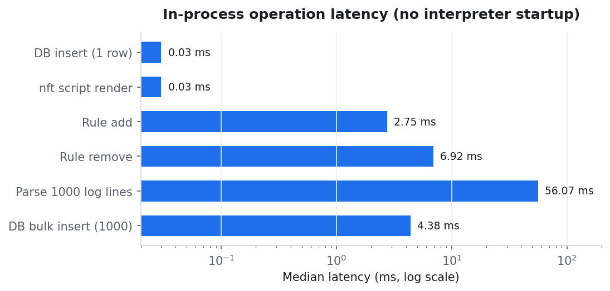
<p class="figcap">Figure 11 &mdash; In-process operation latency (log scale).</p>
</div>

## 19.2 End-to-end CLI latency

<p class="tblcap" id="tbl-perf-e2e">Table 17 &mdash; End-to-end CLI command latency (median wall-clock, includes interpreter start).</p>

| Command | Median | Minimum |
|---|---|---|
| `firewall block-ip` | 320 ms | 308 ms |
| `firewall remove ID` | 311 ms | 306 ms |
| `firewall preview` | 314 ms | 305 ms |
| `report generate` | 327 ms | 316 ms |
| `dashboard --once` | 332 ms | 319 ms |
| `monitor status` | 320 ms | 310 ms |
| `alerts list` | 320 ms | 309 ms |

The spread between commands is small; roughly 300 ms of every figure is the
fixed cost of starting a Python interpreter and importing Rich and PyYAML. The
tool's own work is a few milliseconds. A single detection cycle over the 67-event
demo window completed in **0.002 s**, and a full 8-second demo ingestion of 67
events used a single batch write.

## 19.3 Scaling characteristics

Detection cost scales with the **window**, not the size of the history, because
every detector is an indexed aggregate query bounded by time. Storage cost is
kept flat by batched writes and by retention pruning. The dashboard renders from
a bounded set of queries (top sources, top ports, recent alerts, latest events)
rather than from the full event table.

# 20. Security Analysis

SentinelFW is a security tool, so its own security posture matters. This section
states the threat model and the controls, each of which maps to one or more
tests.

## 20.1 Threat model

- **Malicious input** — an operator is tricked into blocking a crafted
  "address" or writing a crafted comment that escapes the generated nft script.
- **Configuration as a weapon** — a hostile `config.yaml` or `rules.yaml` is
  read and executes code.
- **Confirmation bypass** — a mutation proceeds without a human decision
  because stdin is not a terminal.
- **Containment failure** — a bug causes SentinelFW to modify or flush a table
  it does not own, breaking Docker, UFW or the host's connectivity.
- **Library misuse** — a shell is invoked with a string built from user input.

## 20.2 Controls

<p class="tblcap" id="tbl-security">Table 19 &mdash; Security controls and their tests.</p>

| Control | Implementation | Tests |
|---|---|---|
| Input validation | `ipaddress` for addresses/networks; integer range check for ports; fixed protocol set | R-01…R-11 |
| Injection prevention | Comment sanitiser (strips quotes, backslashes, newlines, `;`); custom rules reject newline/`;` | R-12…R-16, S-06, S-07 |
| Containment | Only `table inet sentinelfw` is ever written; `nft_manager` refuses any other table | R-28, R-29, S-04 |
| Atomic application | Single `nft -f -` transaction; `flush chain`, never `flush table`; verify by read-back | R-28, S-05 |
| Safe deserialisation | `yaml.safe_load` only, everywhere; no `yaml.load`/`FullLoader` | C-09, S-08 |
| No shell | `subprocess.run(argv)` with argument lists; no `shell=True` | Reviewed; S-09 |
| Least privilege | Root only for `apply`, `validate`, `backup`, `restore`, journal reads | S-01, S-02 |
| Explicit consent | Non-interactive mutation refused unless `--yes` | S-03 |
| Confirmation is not bypass of checks | `--yes` suppresses prompts only; `--force` is separate | E-40 |
| File permissions | `config.yaml` and `rules.yaml` at 0600; exports private; `config harden` | C-03, C-14, E-07, E-38 |
| Audit logging | Every `nft` invocation logged to `logs/sentinelfw.log` by a rotating handler | Logging review |
| Honest destructive operations | `restore` states it flushes the entire ruleset; no quieter flag | Docs + CLI text |
| Error handling | One exception class per failure, each with a hint; no tracebacks at the CLI | E-14, E-15, R-26, C-10 |

## 20.3 What SentinelFW does not protect

It is worth being explicit. SentinelFW filters in *one* chain, at priority `-10`,
with an `accept` policy; it is an additional layer, not a hardened perimeter. It
sees only what the kernel logged, so it does not capture packets or inspect
payloads. Findings are heuristics, not proof of compromise. The event database
and reports contain source addresses, ports and timestamps and should be treated
as sensitive; they are gitignored, and `config harden` tightens the config and
rules files.

# 21. Code Coverage

Coverage was measured with `pytest-cov` across the application package. Overall
statement coverage is **72%**. Coverage is highest where correctness is most
safety-critical (detection 94%, configuration 85%, rules 82%, database 82%) and
lowest in the root-only and error branches that the unprivileged suite
deliberately cannot execute (`firewall/backup.py` 30%, `firewall/nft_manager.py`
45%). That distribution is expected and intentional: the untested lines are
precisely the ones that would touch a live firewall.

<div class="figure" id="fig-cov">
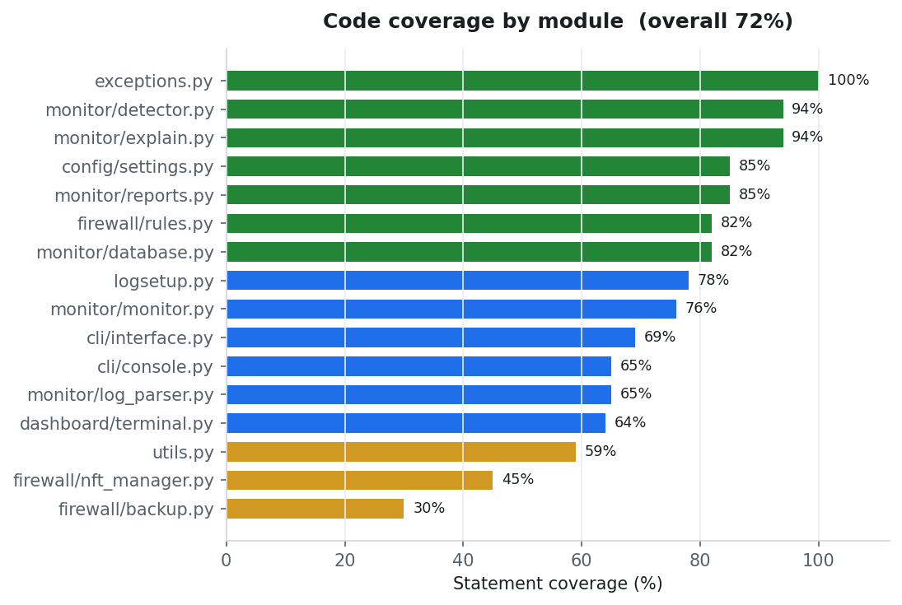
<p class="figcap">Figure 9 &mdash; Code coverage by module (overall 72%).</p>
</div>

<p class="tblcap" id="tbl-coverage">Table 18 &mdash; Coverage by module.</p>

| Module | Statements | Missed | Coverage |
|---|---|---|---|
| `exceptions.py` | 54 | 0 | 100% |
| `monitor/detector.py` | 223 | 14 | 94% |
| `monitor/explain.py` | 110 | 7 | 94% |
| `config/settings.py` | 330 | 48 | 85% |
| `monitor/reports.py` | 294 | 44 | 85% |
| `firewall/rules.py` | 373 | 68 | 82% |
| `monitor/database.py` | 365 | 64 | 82% |
| `logsetup.py` | 51 | 11 | 78% |
| `monitor/monitor.py` | 183 | 44 | 76% |
| `cli/interface.py` | 1110 | 347 | 69% |
| `cli/console.py` | 129 | 45 | 65% |
| `monitor/log_parser.py` | 373 | 130 | 65% |
| `dashboard/terminal.py` | 210 | 76 | 64% |
| `utils.py` | 215 | 89 | 59% |
| `firewall/nft_manager.py` | 279 | 154 | 45% |
| `firewall/backup.py` | 141 | 99 | 30% |
| **Total** | **4460** | **1240** | **72%** |

<div class="figure" id="fig-tests">
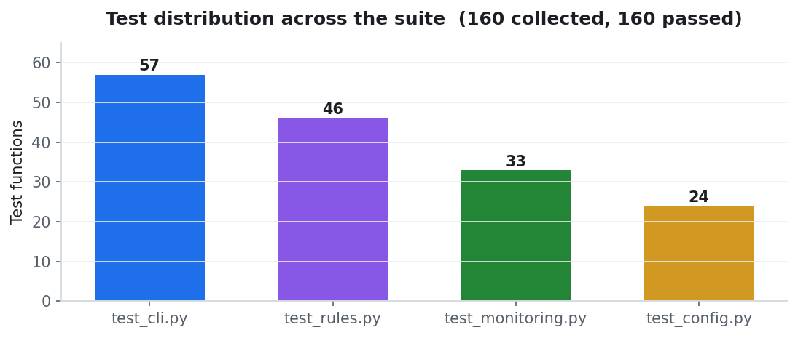
<p class="figcap">Figure 10 &mdash; Test distribution across the suite.</p>
</div>

# 22. Limitations

<p class="tblcap" id="tbl-limits">Table 20 &mdash; Known limitations.</p>

| # | Limitation | Consequence |
|---|---|---|
| L-1 | Not a complete firewall | It manages one chain; a full policy still needs nftables or a distro tool |
| L-2 | Linux and nftables only | No Windows, macOS, pf or iptables backend |
| L-3 | Log-based detection | Anything the kernel does not log cannot be detected |
| L-4 | Heuristic detection | Severity comes from volume and patterns, not payload inspection; false positives are possible |
| L-5 | Thresholds need tuning | Defaults suit a single-purpose host, not a busy server |
| L-6 | Restore is destructive | `firewall restore` flushes the entire ruleset, including Docker's and UFW's |
| L-7 | Demo data is fabricated | `monitor demo` writes to the real database; must be reset afterwards |
| L-8 | Root-only branches untested at runtime | The suite proves refusal and generation, not live `nft` acceptance |
| L-9 | Single host | No remote or multi-host monitoring |
| L-10 | No auto-remediation | It advises; it does not silently ban or change rules |

The last point is a deliberate design choice rather than a shortcoming. Silent
auto-banning is how a tool blocks an address that turns out to matter; SentinelFW
keeps a human in the loop.

# 23. Future Enhancements

<p class="tblcap" id="tbl-future">Table 21 &mdash; Future enhancements.</p>

| # | Enhancement | Rationale |
|---|---|---|
| F-1 | Machine-learning anomaly detection | Complement thresholds with a baseline of normal traffic per host |
| F-2 | Email / Telegram / webhook alerts | Push findings to the operator instead of requiring a poll |
| F-3 | Multi-host collection | A central collector aggregating several SentinelFW agents |
| F-4 | Threat-intelligence feeds | Enrich source IPs with reputation data |
| F-5 | Web dashboard | Browser access for teams |
| F-6 | Container monitoring | Attribute events to Docker/Podman workloads |
| F-7 | Automatic rule suggestions | Generate a block rule from a high-severity alert with one command |
| F-8 | Signed rule bundles / export/import | Share vetted rulesets between machines |
| F-9 | Optional eBPF collector | Reduce dependence on kernel log volume |
| F-10 | Pluggable detectors | A documented detector interface for community rules |

# 24. Conclusion

SentinelFW set out to make two tasks that are usually separate — managing a
firewall and understanding what it does — into one coherent, safe, teachable
tool. It achieved that by refusing to take shortcuts at the points that matter.

Rules never reach the kernel by accident: changes are recorded in a readable
file, previewed in full, backed up, confirmed, applied as a single atomic
transaction, and verified by reading the kernel back. The tool owns exactly one
object and refuses to touch any other, so a bug cannot destroy an unrelated
ruleset. Input is validated and sanitised before it reaches the generated script,
configuration is parsed as data rather than code, and nothing is ever handed to a
shell. Consent is required, and `--yes` deliberately does not bypass the safety
checks.

On the monitoring side, the tool turns opaque kernel log lines into structured
events, applies five transparent and tunable detectors, de-duplicates findings,
and explains each one in plain language with concrete next steps. A dashboard,
three report formats and a knowledge base make the result usable.

The project is backed by **160 passing tests** in about **51 seconds**, **72%
statement coverage** concentrated on the correctness-critical modules, and a test
suite that is itself safe: it never invokes `nft` and never needs root. Measured
performance is dominated by Python interpreter startup, not by SentinelFW's own
work, which completes in milliseconds.

What remains is deliberate. SentinelFW is a manager, not a firewall; it is
single-host by design; its detection is heuristic; and it advises rather than
auto-remediates. Those are boundaries, honestly stated, not flaws hidden. Within
them, SentinelFW does what it promised: it makes a firewall change inspectable,
reversible and explained.

# 25. References

1. The netfilter project. *nftables wiki.* https://wiki.nftables.org/
2. The netfilter project. *nft(8) manual page.*
3. Python Software Foundation. *Python 3 documentation.* https://docs.python.org/3/
4. Python Software Foundation. *`ipaddress` — IPv4/IPv6 manipulation library.*
5. SQLite Consortium. *SQLite documentation.* https://sqlite.org/docs.html
6. PyYAML. *PyYAML documentation.* https://pyyaml.org/wiki/PyYAMLDocumentation
7. Textualize. *Rich documentation.* https://rich.readthedocs.io/
8. pytest development team. *pytest documentation.* https://docs.pytest.org/
9. systemd project. *`journalctl(1)` manual page.*
10. Keep a Changelog. https://keepachangelog.com/
11. Semantic Versioning. https://semver.org/
12. OWASP Foundation. *Command Injection* and *Deserialization Cheat Sheets.*
13. SentinelFW. *Safety model (`docs/SAFETY.md`).* Repository documentation.

# Appendix A — Installation

Everything on Kali, Debian and Ubuntu comes from `apt`:

```bash
sudo apt update
sudo apt install -y nftables python3-rich python3-yaml
```

Run it straight from the clone, with nothing to install:

```bash
git clone https://github.com/Lucky-Joshi/SentinelFW.git
cd SentinelFW
./sentinelfw doctor
```

Optional system-wide install (Kali's Python is externally managed, so use
`pipx`):

```bash
sudo apt install -y pipx
pipx install .
sentinelfw doctor
```

# Appendix B — First Session

```bash
./sentinelfw doctor                 # check the machine
./sentinelfw config init            # create config.yaml (mode 0600)
./sentinelfw monitor demo --seconds 30   # synthetic traffic, no root
./sentinelfw dashboard --once
./sentinelfw alerts list --explain
./sentinelfw report generate

./sentinelfw firewall block-ip 203.0.113.7 -r "scanner"   # records only
./sentinelfw firewall preview                              # exact nft script
sudo ./sentinelfw firewall apply                           # atomic, verified
```

# Appendix C — Sample Configuration

```yaml
firewall:
  table: sentinelfw
  family: inet
  chain: input
  hook: input
  priority: -10
  policy: accept
  log_enabled: true
  log_level: info
  log_prefix: SENTINELFW

database:
  path: database/events.db
  retention_days: 90

monitoring:
  source: journal          # journal | file | demo
  log_files:
    - /var/log/kern.log
    - /var/log/syslog

detection:
  port_scan_threshold: 20
  brute_force_threshold: 100
  spike_threshold: 300
  repeated_block_threshold: 50
  alert_cooldown_seconds: 900
```

# Appendix D — Full Test Inventory

The following table lists all 160 tests. Every test passed.

{{FULL_TEST_INVENTORY}}

# Appendix E — Sample Logs and Evidence

Example firewall log lines the parser recognises (the prefix is what it looks
for):

```
Oct  4 03:10:02 kali kernel: [SENTINELFW-DROP ] IN=eth0 OUT= MAC= SRC=203.0.113.9 DST=198.51.100.1 LEN=40 PROTO=TCP SPT=40000 DPT=22
Oct  4 03:10:03 kali kernel: [SENTINELFW-ACCEPT ] IN=eth0 OUT= MAC= SRC=198.51.100.7 DST=198.51.100.1 LEN=60 PROTO=TCP SPT=51000 DPT=443
```

The generated nft script for the rules recorded during the verification session
(three rules), as produced by `firewall preview`:

```
add table inet sentinelfw
add chain inet sentinelfw input { type filter hook input priority -10; policy accept; }
flush chain inet sentinelfw input
add rule inet sentinelfw input ip saddr 198.51.100.0/24 counter log prefix "SENTINELFW-ACCEPT " level info accept comment "lab net"
add rule inet sentinelfw input ip saddr 203.0.113.7 counter log prefix "SENTINELFW-DROP " level info drop comment "scanner"
add rule inet sentinelfw input tcp dport 23 counter log prefix "SENTINELFW-DROP " level info drop comment "telnet off"
```

Observed monitor statistics after an 8-second demo run:

```json
{
  "total_events": 67,
  "blocked_events": 67,
  "accepted_events": 0,
  "unique_sources": 6,
  "unique_ports": 16,
  "alert_total": 3,
  "alerts_by_severity": { "high": 3 }
}
```

**End of report.**
